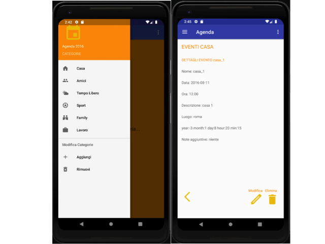

# Android Application Agenda with Java Rest Server

>Android Application that allows you to insert, view and edit events based on pre-set categories.

>It also provides a login functionality. Authentication occurs by calling a mysql database exposed by the local Rest Java service available at the link <a href="https://github.com/m4lc0m/android-app-agenda/tree/master/agenda-rest-server" target="_blank">`agenda-rest-server`</a>.

---

## Table of Contents (Optional)

> If your `README` has a lot of info, section headers might be nice.

- [Documentation](#Documentation)
- [Run](#Run)
- [Database](#Database)
- [Support](#Support)

---
## Documentation

> Android version: 9

> Android API: 28

> Minimum API supported: 21

> Gradle version: 3.3.1

---
## Run

> Start first the server

### Run Java Rest Server

> Open the class DBConfiguration and set mysql username and password

> Build with maven `mvn install`

**Run with docker**

> Run with docker command `docker-compose up --build`

**Run with eclipse**

> Run with Eclipse and Tomcat

### Run Android Application

> When server is started run the application

**Run with Android Studio**

> Build and run the project with Android Studio and run the application with emulator.

**Run with Android Device**

> Build apk with Android Studio and set the same connection between device and server on your local machine. 

---

## Database

> The sql file to generate the database is already present in the server directory.

### Configuration

> Start MySql Workbench

> Set connection to localhost with port 3306.

> Set username and password, the same of DBConfiguration class in the server.

### Population - Login example

> Create database agenda with command `CREATE DATABASE  IF NOT EXISTS 'agenda'`;

> Use db with `USE 'agenda'`;

> Drop and create table login with `DROP TABLE IF EXISTS `login`;

> Create table with `CREATE TABLE 'login' ('id_login' int(20) unsigned NOT NULL AUTO_INCREMENT,'username' varchar(150) NOT NULL,'password' varchar(150) NOT NULL,PRIMARY KE('id_login'),UNIQUE KEY 'userName' ('username'));`

> Insert user with command `INSERT INTO 'login' VALUES (1,'username','0581938f0767a65b373cea80e905c25f'),(2,'admin','21232f297a57a5a743894a0e4a801fc3');`

---

## Support

Reach out to me at one of the following places!

- Email at `m4lc0m90@gmail.com`</a>