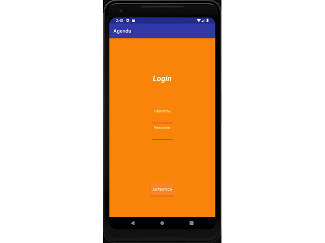

# Agenda Android Application 


> Subtitle or Short Description Goes Here



> ideally one sentence

> include terms/tags that can be searched

---

## Table of Contents (Optional)

> If your `README` has a lot of info, section headers might be nice.

- [Installation](#installation)
- [Features](#features)
- [Contributing](#contributing)
- [Team](#team)
- [FAQ](#faq)
- [Support](#support)
- [License](#license)


---

## Example (Optional)

```javascript
// code away!

let generateProject = project => {
  let code = [];
  for (let js = 0; js < project.length; js++) {
    code.push(js);
  }
};
```

---

## Installation

- All the `code` required to get started
- Images of what it should look like

### Clone

- Clone this repo to your local machine using `https://github.com/fvcproductions/SOMEREPO`

### Setup


---

## Features
## Usage (Optional)
## Documentation (Optional)
## Tests (Optional)

---

### Step 1

- **Option 1**
    - 🍴 Fork this repo!

- **Option 2**
    - 👯 Clone this repo to your local machine using ``

### Step 2

- **HACK AWAY!** 🔨🔨🔨

### Step 3

---

## FAQ

- **How do I do *specifically* so and so?**
    - No problem! Just do this.

---

## Support

Reach out to me at one of the following places!

- Email at `girolamo.musto@gmail.com`</a>

